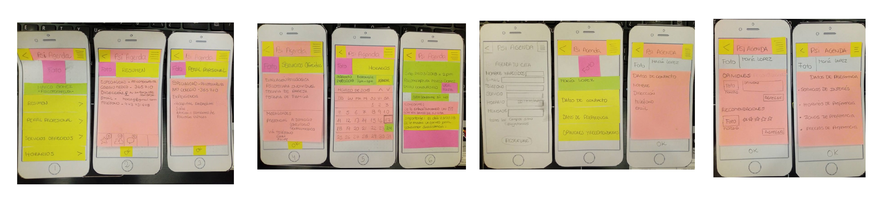
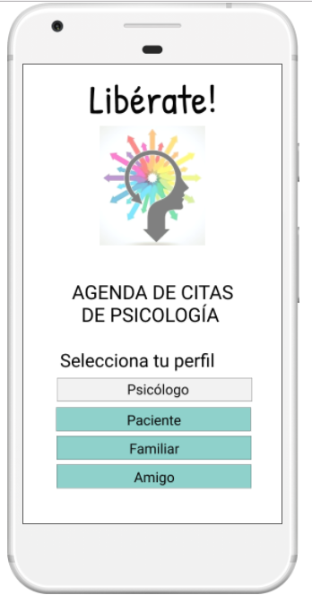
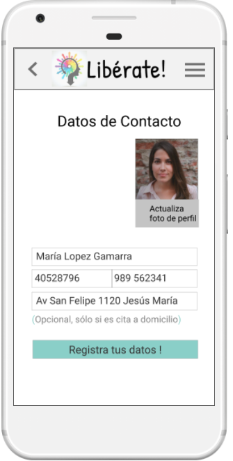
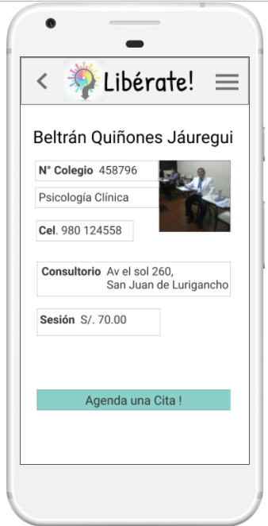
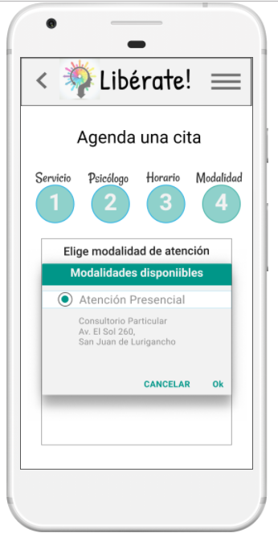
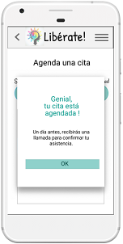

# Libérate

Es una app que permite llevar una agenda de citas de psicología. Esta puede ser utilizada
por los profesionales psicólogos independientes y pacientes que soliciten agendar una cita.

## Proyecto desarrollado en [Laboratoria](http://laboratoria.la) 

## En  [Peru](http://peru.com)

### 🚩 Tabla de contenido

- [Necesidad de resolver un problema](#necesidad-de-resolver-un-problema)
- [Modelo de Negocio](#modelo-de-negocio)
- [Stakeholders](#stakeholders)
- [Plan Research](#plan-research)
- [Cronograma de Actividades](#cronograma-de-actividades)
- [Kick Off](#kick-off)
- [Proceso Research](#-proceso-research)
  - [Cuantitativo](#cuantitativo)   
  - [Cualitativo](#cualitativo)
- [User Personas](#user-personas)
- [Características del Producto](#características-del-producto)
- [Prototipo](#prototipo)
- [Demo](#demo)
- [Herramientas](#herramientas)

## Necesidad de resolver un Problema

### Para quiénes?
| Clientes(usuarios) |Descripción  | Necesidad relacionada |
| ---- | ---- | ---- |
| **Paciente**  |Profesionales de psicología que brindan servicios|Agendar una cita de psicología|
| **Psicólogo** |Personas que solicitan servicios de psicología |Agendar las citas de psicología |

### Identificación de punto crítico en servicio de citas psicológicas
Dentro del servicio de atención psicológica con psicólogos independientes, 
un punto crítico es la parte de agendar citas.

### Contexto de Necesidades vs Usuarios

| Cita Psicológica |Tecnología  | Descripción |
| ---- | ---- | ---- |
| **Agendar convencional**|Presencial | Requiere la recomendación y desplazamiento físico  |
| **Agendar convencional**|Vía Teléfono | Requiere la recomendación y saber el nro de teléfono |
| **Agendar através de web**|Vía Web  | Requiere tener una conexión a internet, una computadora, esperar una llamada ó/y email de confirmación  |
| **Agendar através de movile** |Vía Movile | Requiere una llamada y email de confirmación   |

### Problema
Agendar una cita implica para el psicólogo independiente
- Organización manual
- Encargar a una recepcionista
- Constante coordinación con paciente para confirmación de cita

Agendar una cita implica para el cliente ( paciente)
- No tienen tiempo
- Recomendación de experticia
- Búsqueda del psicólogo adecuado
- Diversidad de tarifas de sesiones
- Horarios noche o de fines de semana

Conclusiones 
Diseñar una agenda de cita psicológicas
- Sea fácil de usar
- Reuna información relevante para escoger psicólogo
- Mínimo tiempo para realizar las coordinaciones para confirmación
- Información para elección por : servicio, ubicación, tarifa sesión

## Modelo de Negocio

Se identificó y elaboró un modelo de negocios.

| Entregable | Documentación  |
| ----       | ----           |
| **Modelo de Negocio** | https://canvanizer.com/canvas/wKUTJtzmNCyw6  |

## Proceso Research

### Plan Research
Se elaboró un plan research , para conducir el proceso de investigación.

| Entregable | Documentación  |
| ----       | ----           |
| **Plan Research** |https://goo.gl/hQrRM1|

#### Cuantitativo
- Se realizó una recopilación de soluciones y data ya existentes.
- Asimismo se revisó información estadística de la oferta y demanda de atenciones psicológicas en el país.

Teniendo las siguientes conclusiones :

Del lado del Profesional Psicólogo:
- En Lima el sueldo promedio de un psicólogo en el sector público es de apróx. S/ 1,800.
- Los que están en el Servicio Rural Urbano Marginal en Salud (Serum) en Lima pueden ganar apróx. S/ 2,500 soles.
- Los que trabajan en provincia el sueldo puede ser de apróx. S/ 4,000 soles.
- Mientras que la consulta privada ha aumentado y dependiendo de la zona, en la clase media y clase alta pagan entre S/ 100 y S/ 150 por consulta a un psicólogo especialista o a los psicoterapeutas.

De la oferta de atenciones psicológicas:
- Necesidad de fortalecimiento de los sistemas de atención primaria.
- Necesidad en inversión de campañas de concientización para las personas.
- Durante el 2016, en el Perú se implementaron 22 centros de salud mental comunitarios en 6 regiones.
- En el Perú existe solo un psicólogo clínico por cada 10,000 habitantes.
- Perú tiene un déficit importante de profesionales especialistas en problemas de salud mental.
- El 20% de la población requiere atención especializada de salud mental.
- El 20% se traduce en 1'800,000 de posibles atenciones a nivel Lima.

De la demanda de atenciones psicológicas:
- Alrededor de 4 millones de peruanos tienen una enfermedad mental. 
- En el Perú 2 de cada 10 peruanos dicen tener un familiar o amigo cercano con algún problema de salud mental.
- 1 de cada 5 personas tiene un desorden mental.
- En el Perú, 4 millones de personas tienen alguna enfermedad mental, pero solo 800 mil reciben un tratamiento apropiado.
- Una de las principales causas es no reconocer adecuadamente los problemas de salud mental, o bien no se les brinda importancia.
- La depresión y los trastornos de ansiedad son los más comunes en el Perú y en el mundo.
- En el mundo 600 millones de personas sufren de depresión y trastornos de ansiedad.
- El 80% de problemas de salud mental se podrían resolver en el primer nivel de atención.
- El 80% de personas con esquizofrenia pueden recuperarse y dejar atrás los síntomas después de un año de tratamiento y apoyo de los seres queridos.

| Entregable | Documentación  |
| ----       | ----           |
| **Cuantitativo** | https://goo.gl/8ePPmj |

#### Cualitativo
Se realizaron entrevistas a psicólogos , a posibles de clientes y encuestas vía online.
De las cuales se obtuvieron las siguientes conclusiones:

Del lado de profesionales de Psicología:
- Importancia por la organización de tiempos y actividades
- Agendan las citas por teléfono
- No tienen un organizador de citas vía web o movil
- Dentro de las ocurrencias de las citas programadas son: la derivación y reprogramación de cita
- Si utilizarían un aplicativo web o movil
- Prefieren que muestre los horarios disponibles, agendar cita, recordatorios de fecha de cita próxima y confirmación mutua previa al día.

Del lado de posibles usuarios clientes:
- Importancia por las atenciones psicológicas
- No han utilizado una aplicación web o movil para agendar una cita
- Prefieren elegir un psicólogo por recomendación
- Importancia por que se pueda visualizar información del profesional
- Importancia en la experiencia del psicólogo
- Preferencia por visualizar los horarios disponibles
- Si estarían dispuestos ayudar a un amigo o familiar cercano para  conctactar con un psicologo 

| Entregable | Documentación  |
| ----       | ----           |
| **Cualitativo** | https://goo.gl/eymUBG|

## User Personas
Se ha elaborado un usuario de persona para caracterizar los tipos de usuario 
- Psicologo que requiere agendar cita
- Paciente  que requiere agendar cita

| Entregable | Documentación  |
| ----       | ----           |
| **User persona (Psicólogo)** |https://realtimeboard.com/app/board/o9J_kztSo_g=/ |
| **User persona (Paciente)** |  https://realtimeboard.com/app/board/o9J_kzz_RTk=/|

## Características del producto
Se identificaron las características del producto através un análisis, teniendo como resultado las siguientes principales
características a considerar:

| Características | Descripción |
| ----       | ----       |
| **Psicólogo**  | Registro de: perfil, servicios, horarios, modalidad de atención  |
| **Paciente** | Registro de: perfil, cita ( elección de servicio, psicólogo, horario y modalidad de atención) |

| Entregable | Documentación  |
| ----       | ----           |
| **Cuadro de Carácterísticas** | https://goo.gl/SkCKB1|

## Prototipo

Se ha elaborado un prototipo en papel

## Demo
Se ha prototipado el diseño , y este está disponible en el siguiente link:
https://marvelapp.com/4jcf5ad/screen/40108295

## Herramientas
| Herramientas | Entregable |
| ----       | ----       |
| **Figma**  | Prototipo  |
| **Marvel** | Prototipo  |

